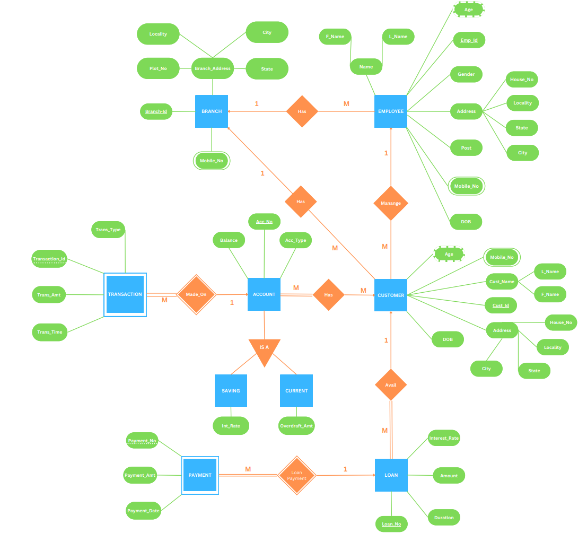

# Banking Management System

A Banking Management System (BMS) is a type of Database Management System (DBMS)
that is used to manage the operations of banks and financial institutions. A DBMS is a
software system that is used to manage databases, which are collections of data that are
organized in a structured manner. The BMS is a critical component of modern banking
infrastructure, as it enables banks to efficiently manage their operations and provide excellent
customer service.

The BMS is designed to support various banking functions, including customer information
management, account management, transaction processing, and reporting. The system is
responsible for managing and organizing vast amounts of data related to banking operations,
such as customer information, account balances, transaction histories.

## ER Diagram

## ER to Table

### 1NF
.png)

### 2/3NF
.png)
